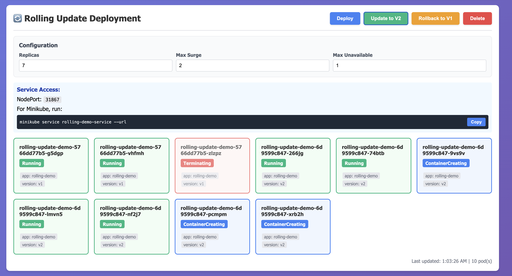

# Kubernetes Deployment Dashboard



Demonstration for three types of software deployment methods: Rolling Updates, Canary, Blue/Green.

See this drawing for more info: [Excalidraw](https://excalidraw.com/#json=IFSo0h9d64vxWMyOo_ztN,ENr1Mtx_44kgoXKHc5befw)

Youtube Video (Arabic): [https://www.youtube.com/watch?v=yYxxVzjvcms](https://www.youtube.com/watch?v=yYxxVzjvcms)

## Prerequisites

- Minikube or any Kubernetes cluster running
- `kubectl` configured and connected to your cluster
- python@3.10+

## Setup

1. **Start kubectl proxy:**

```bash
kubectl proxy --port=8001
```

and in another terminal:

```bash
python3 cors-proxy.py
```

2. **Open the dashboard:**

```bash
open dashboard.html
# Or simply double-click dashboard.html
```

3. The dashboard should automatically connect to `http://localhost:8002` or

---

## Troubleshooting

### Dashboard won't connect

1. **Check kubectl proxy is running:**

```bash
curl http://localhost:8001/api/v1/namespaces/default/pods
```

### Pods not appearing

1. **Check if pods are running:**

```bash
kubectl get pods -l app=rolling-demo
kubectl get pods -l app=canary-demo
kubectl get pods -l app=bluegreen-demo
```

2. **Check namespace:**

- Dashboard is configured for the `default` namespace
- Ensure deployments are in the `default` namespace

### CORS Errors (when using HTTPS API URL)

This is common with direct API access. Solutions:

1. Use kubectl proxy instead:

```bash
kubectl proxy --port=8001
```

2. Or visit the API URL in your browser first and accept the certificate

---

## Cleanup

To remove all resources:

```bash
# Delete deployments
kubectl delete -f rolling-update/
kubectl delete -f canary/
kubectl delete -f blue-green/

# Delete RBAC resources
kubectl delete -f rbac/
```
